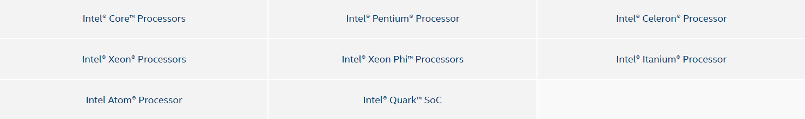

# [intel](https://github.com/sochub/intel)

 

#### 归属：[X86 architecture](https://github.com/sochub/X86)

#### [关于SoC开发平台](https://github.com/sochub)

## [描述](https://github.com/sochub/intel/wiki) 

intel资源整理

 

## [组成](SoC/) 

#### [atom](https://github.com/sochub/atom) 

移動和低功耗處理器

---

###  [嵌入式开发平台](http://www.qitas.cn)   

###  qitas@qitas.cn